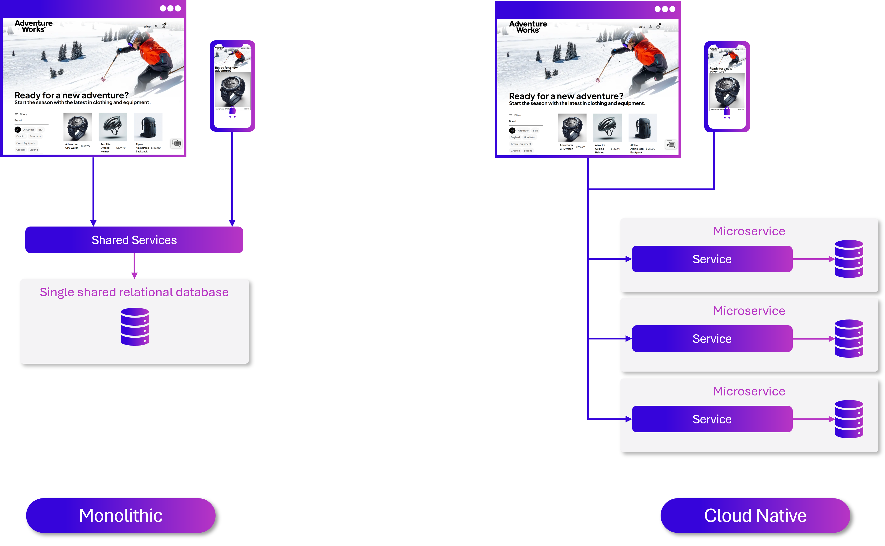
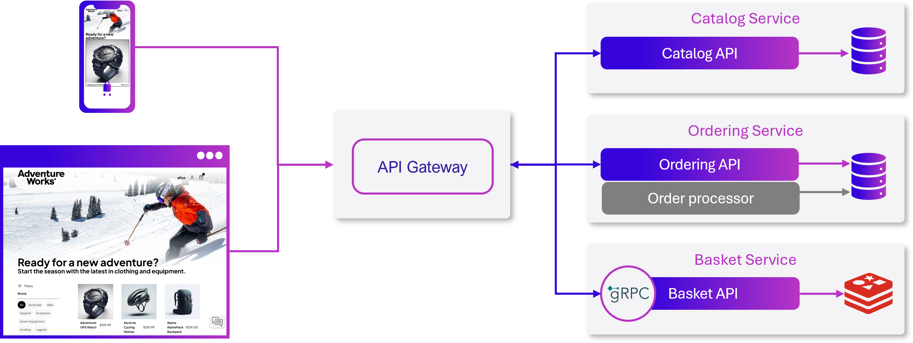
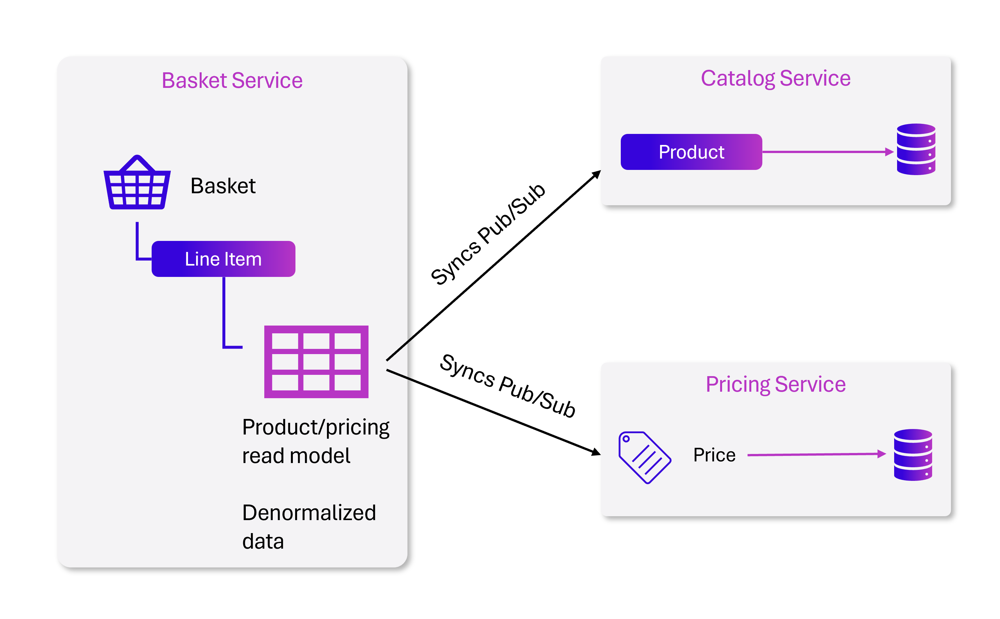
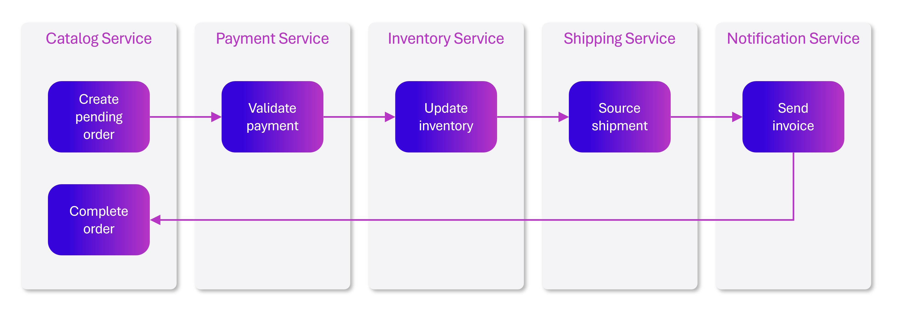
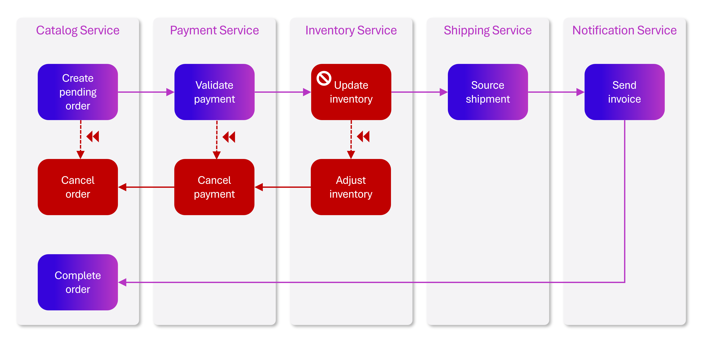

# Data patterns for distributed applications

[!INCLUDE [download-alert](../includes/download-alert.md)]

A cloud-native approach changes the way you design, deploy, and manage applications. It also changes the way you manage and store data.

Figure 5-1 contrasts the differences.

**Figure 5-1**. Data management in cloud-native applications

The left side of figure 5-1 shows a *monolithic application*, business service components collocate together in a shared services tier, sharing data from a single relational database.

Designing for cloud-native, we take a different approach. On the right-side of Figure 5-1, note how business functionality segregates into small, independent [microservices](/azure/architecture/guide/architecture-styles/microservices). Each microservice encapsulates a specific business capability and its own data. This is a *database per microservice* design.

## Why use a database per microservice?

This database per microservice provides many benefits, especially for systems that must evolve rapidly and support massive scale. With this model:

- Domain data is encapsulated within the service.
- Data schema can evolve without directly impacting other services.
- Each data store can independently scale.
- A data store failure in one service won't directly impact other services.

Segregating data also enables each microservice to implement the data store type that is best optimized for its workload, storage needs, and read/write patterns. Choices include relational, document, key-value, and even graph-based data stores.

Figure 5-2 presents the principle of polyglot persistence in a cloud-native system.

**Figure 5-2**. Polyglot data persistence

Note that in this figure, each microservice supports a different type of data store:

- The product catalog microservice consumes a relational database to accommodate the rich relational structure of its underlying data.
- The shopping cart microservice consumes a distributed cache that supports its simple, key-value data store.
- The ordering microservice consumes both a NoSQL document database for write operations along with a highly denormalized key/value store to accommodate high-volumes of read operations.
  
## Cross-service queries

While microservices are independent and focus on specific functional capabilities, like inventory, shipping, or ordering, they frequently require integration with other microservices. Often the integration involves one microservice *querying* another for data. Figure 5-3 shows the scenario.

**Figure 5-3**. Querying across microservices

The figure shows a shopping basket microservice that adds an item to a user's shopping basket. While the data store for this microservice contains basket and line item data, it doesn't maintain product or pricing data. Instead, those data items are owned by the catalog and pricing microservices. This arrangement presents a problem. How can the shopping basket microservice add a product to the user's shopping basket when it has neither product nor pricing data in its database?

To deal with this we can use the [Materialized View pattern](/azure/architecture/patterns/materialized-view), shown in Figure 5-4.

**Figure 5-4**. Materialized View pattern

With this pattern, you place a local data table, known as a *read model*, in the shopping basket service. This table contains a denormalized copy of the data needed from the product and pricing microservices. Copying the data directly into the shopping basket microservice eliminates the need for expensive cross-service calls. With the data local to the service, you improve the service's response time and reliability. Additionally, having its own copy of the data makes the shopping basket service more resilient. If the catalog service becomes unavailable, it doesn't directly impact the shopping basket service.

## Distributed transactions

In cloud-native applications, you must manage distributed transactions programmatically. You move from a world of *immediate consistency* to that of *eventual consistency*.

Figure 5-5 shows the problem.

**Figure 5-5**. Implementing a transaction across microservices

In the preceding figure, five independent microservices participate in a distributed transaction that creates an order. Each microservice maintains its own data store and implements a local transaction for its store. To create the order, the local transaction for *each* individual microservice must succeed, or *all* must abort and roll back the operation. While built-in transactional support is available inside each of the microservices, there's no support for a distributed transaction that would span across all five services to keep data consistent.

A popular pattern for adding distributed transactional support is the [Saga pattern](/azure/architecture/reference-architectures/saga/saga):

**Figure 5-6**. Rolling back a transaction

In this figure, the *Update Inventory* operation has failed in the Inventory microservice. The Saga pattern invokes a set of compensating transactions (in red) to adjust the inventory counts, cancel the payment and the order, and return the data for each microservice back to a consistent state.

## High volume data

Large cloud-native applications often support high-volume data requirements. In these scenarios, traditional data storage techniques can cause bottlenecks. For complex systems that deploy on a large scale, Event Sourcing may improve application performance.

### Event Sourcing

Another approach to optimizing high volume data scenarios involves [Event Sourcing](/azure/architecture/patterns/event-sourcing).

A system typically stores the current state of a data entity. In high volume systems, however, overhead from transactional locking and frequent update operations can impact database performance, responsiveness, and limit scalability.

Event Sourcing takes a different approach to capturing data. Each operation that affects data is persisted to an event store. Instead of updating the state of a data record, we append each change to a sequential list of past events - similar to an accountant's ledger. The event store becomes the system of record for the data. It's used to propagate various materialized views within the bounded context of a microservice. Figure 5.8 shows the pattern.

**Figure 5-8**. Event Sourcing

In the previous figure, note how each entry (in blue) for a user's shopping cart is appended to an underlying event store. In the adjoining materialized view, the system projects the current state by replaying all the events associated with each shopping cart. This view, or read model, is then exposed back to the UI.

For this pattern, consider a data store that directly supports event sourcing. Azure Cosmos DB, MongoDB, Cassandra, CouchDB, and RavenDB are good candidates. Additionally, while event sourcing can provide increased performance and scalability, it comes at the expense of complexity and a learning curve.

### Data sharding

You use [data sharding](/azure/architecture/patterns/sharding) to partition your data horizontally. Each shard has the same schema and holds its own distinct subset of data. A shard is a data store in its own right and it can contain the data for many entities of different types. The benefits of sharding include:

- You can scale the system out by adding further shards running on additional storage nodes.
- You can reduce contention and improve performance by balancing the workload across shards.
- Shards can be located physically closer to the users that need access to the data.

The main challenge with sharding is deciding how to partition your data across the shards. You need to ensure that data is evenly distributed, and that the system can handle the failure of a shard without losing data or compromising the system's availability. Three strategies are commonly used to help with this challenges:

- **Lookup strategy**: a lookup service maps each entity to the shard that contains it.
- **Range strategy**: entities are distributed across shards based on a range of values.
- **Hash strategy**: a hash function is used to map entities to shards.

>[!div class="step-by-step"]
>[Previous](../event-based-communication-patterns/subscribe-events.md)
>[Next](relational-vs-nosql-data.md)
